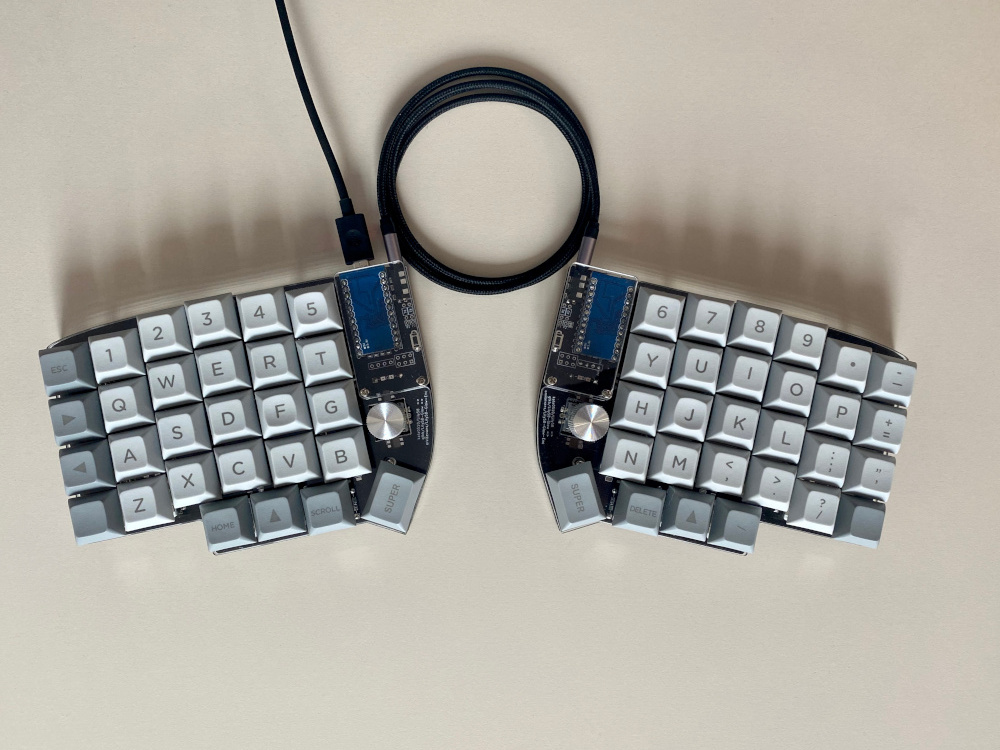

# My lily58_keymap
My qmk keymap for Lily58 split keyboard made on top of [qmk keyboard firmware](https://github.com/qmk/qmk_firmware), that runs on ATmega32u4 Pro Micro board.

## Keymap


```c
/* QWERTY
 * ,-----------------------------------------.                    ,-----------------------------------------.
 * |ESC/~ |   1  |   2  |   3  |   4  |   5  |                    |   6  |   7  |   8  |   9  |   0  |  -   |
 * |------+------+------+------+------+------|                    |------+------+------+------+------+------|
 * | Tab  |   Q  |   W  |   E  |   R  |   T  |                    |   Y  |   U  |   I  |   O  |   P  |  =   |
 * |------+------+------+------+------+------|                    |------+------+------+------+------+------|
 * |LCTRL |   A  |   S  |   D  |   F  |   G  |-------.    ,-------|   H  |   J  |   K  |   L  |   ;  |  '   |
 * |------+------+------+------+------+------|  Mute |    |  Next |------+------+------+------+------+------|
 * | RAlt |   Z  |   X  |   C  |   V  |   B  |-------|    |-------|   N  |   M  |   ,  |   .  |   /  | RAlt |
 * `-----------------------------------------/       /     \      \-----------------------------------------'
 *                   |SUPER | LS/( |LOWER | /Space  /       \Enter \  |BackSP| RS/) |  \   |
 *                   |      |      |      |/       /         \      \ |      |      |      |
 *                   `----------------------------'           '------''--------------------'
 */
 ```
 
 ```c
 /* LOWER
 * ,-----------------------------------------.                    ,-----------------------------------------.
 * |  F1  |  F2  |  F3  |  F4  |  F5  |  F6  |                    |  F7  |  F8  |  F9  | F10  | F11  | F12  |
 * |------+------+------+------+------+------|                    |------+------+------+------+------+------|
 * |      |      |   {  |   (  |   [  |      |                    |      |  ]   |  )   |  }   |      |      |
 * |------+------+------+------+------+------|                    |------+------+------+------+------+------|
 * |   `  |   !  |   @  |   #  |   $  |   %  |-------.    ,-------| LEFT | DOWN |  UP  |RIGHT |   )  |   -  |
 * |------+------+------+------+------+------|       |    |       |------+------+------+------+------+------|
 * |      |      |      |      |      |      |-------|    |-------|      |   _  |   +  |   {  |   }  |   |  |
 * `-----------------------------------------/       /     \      \-----------------------------------------'
 *                   | LAlt | LGUI |LOWER | /Space  /       \Enter \  |RAISE |BackSP| RGUI |
 *                   |      |      |      |/       /         \      \ |      |      |      |
 *                   `----------------------------'           '------''--------------------'
 */
 ```

## Prerequisites
To be able to compile and flash firmware you will need:
- qmk ([documentation](https://docs.qmk.fm/#/newbs_getting_started))


## Installation
Assuming that you have qmk firmware installed, to install my lily58 keymap:
- clone this repo and rename it into the `~/qmk_firmware/keyboards/lily58/keymaps/bartoszpiech/` folder,
- run `qmk compile -kb lily58 -km bartoszpiech` (now your .hex file should be located in `~/qmk_firmware/.build/lily58_rev1_bartoszpiech.hex`),
- connect the first part of your keyboard to usb,
- run `qmk flash -kb lily58 -km bartoszpiech`

## To-do
- [X] Program Rotary encoders,
- [X] Add more than two layers,
- [X] Add OLED screens,
- [ ] Write a daemon that updates OLED with information about pc resources,
